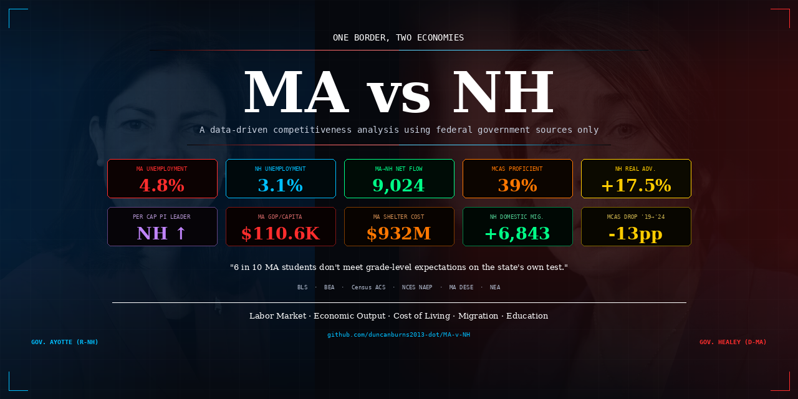

<p align="center">
  
</p>

# MA vs NH: One Border, Two Economies

**A data-driven competitiveness analysis of Massachusetts and New Hampshire using exclusively federal government data sources.** No media rankings, no think-tank scores — just the numbers.

> _"Massachusetts ranks #1 in the nation on education... but 6 in 10 students don't meet grade-level expectations on the state's own test."_

---

## 🔴 Live Dashboard

**[→ View the interactive dashboard](https://duncanburns2013-dot.github.io/MA-v-NH/)**

Built as a single-file HTML dashboard with 16 interactive Chart.js visualizations, animated counters, crosshair hover effects, and a dark editorial design aesthetic.

---

## Key Findings

### Labor Market
- **MA unemployment: 4.5%** vs **NH: 3.0%** (May 2026, SA, latest available) — MA still runs above the national rate (4.2–4.3%)
- New England payroll employment was flat (0% YoY through April 2026) per the Boston Fed's June 2026 report, an improvement after 10 straight months of small declines
- New England's regional unemployment rate hit 4.4% in April 2026, just above the 4.3% national rate; MA's 4.5% and RI's rate exceed the national rate, but not by a statistically significant margin

### Economic Output — Total vs Per Capita
- MA GDP per capita **$114.6K** (#2 nationally, 2025) — genuinely high output per person
- MA total PCE growth **5.3%** (#1 nationally, 2024 — latest available) — but inflated by population growth
- **Per capita**, the gap narrows dramatically:
  - PCE growth: MA 4.2% vs NH 3.9% (0.3pp gap, not 0.9pp)
  - **Per capita income growth: NH leads MA — +3.5% vs +3.3%**
- MA spent ~$932M in FY2024 on emergency shelters under the right-to-shelter law. This is government consumption, not PCE — but new residents' household spending inflates total PCE mechanically

### The Income Illusion — Corrected
- **Newly released 2024 BEA cost-of-living data significantly narrows the affordability gap** used in earlier versions of this analysis. NH's Regional Price Parity is **104.2** (4.2% above the national average) — not the ~97 estimate used previously. MA's is **105.8**.
- A $100K earner retains:
  - **$89,793** in purchasing power in MA (5% income tax + 5.8% higher prices)
  - **$95,969** in NH (0% income tax + 4.2% higher prices)
  - **$6,176 real advantage for NH (6.9%)** — down from the previously reported $15,324 (17.5%)
  - Housing rents still drive most of the remaining gap: MA rents index at 128.1 vs NH's 114.9
  - *Note: MA's 9% rate only applies to income above ~$1.08M (Fair Share surtax)*

### Migration — Two Data Sources, Same Direction
- **ACS state-to-state flows (2023–2024):** NH flipped to **net positive domestic migration: +6,843** (was −7,058 in 2023). MA→NH corridor: 9,024 net people, nearly double the prior year. MA domestic outflow: −30,553, offset by +66,158 international immigration
- **Census Population Estimates (Jul 2024–Jul 2025, released Jan 2026):** NH gained +6,600 net domestic migrants and +2,400 international, for +6,800 total. MA's international immigration **fell sharply from 77,957 to 40,240** — part of a nationwide slowdown — while domestic outflow held around −33,340; MA still grew overall (+15,524) but by a thinner margin than in 2024

### Education — Behind the Rankings
- MA is **#1 on NAEP** (national test) — but that's because every state struggles; MA just struggles less
- **MCAS Reality (MA's own test):** Only **39% ELA** and **41% math** proficiency in grades 3–8
- **Pandemic collapse:** ELA dropped from 52% (2019) → 39% (2024). Grade 10 math: 59% → 45%
- **Gateway Cities divide:** Affluent suburbs (Weston, Lexington) score **72–82%** vs working-class cities (Lawrence, Holyoke) at **9–18%**
- UMass Donahue Institute: **84% of MCAS score variation** explained by socioeconomic factors
- MA voters **repealed MCAS** as graduation requirement (Question 2, Nov 2024)

---

## Data Sources — Government Only

| Agency | Dataset | Vintage |
|--------|---------|---------|
| **BLS** | LAUS (unemployment), CES (payroll), QCEW (wages) | May 2026 / 2023 Annual |
| **BEA** | GDP by State, RPP, Real PCE & PI (SARPI) | 2025 GDP · 2024 RPP/PCE (latest available) |
| **Census** | ACS State-to-State Migration Tables | 2023–2024 |
| **Census** | Population Estimates Program (components of change) | Vintage 2025 (Jul 2024–Jul 2025) |
| **NCES** | NAEP 2024, CCD School Finance FY22 | 2024 |
| **MA DESE** | MCAS Achievement Results | Spring 2024 & 2025 |
| **NEA** | Rankings & Estimates 2023–24 | 2024 |
| **UMass** | Donahue Institute (MCAS variance study) | Cited |
| **MA Admin** | Emergency Assistance Shelter Reports | FY2024–25 |
| **Boston Fed** | New England Economic Conditions | Through Jun 2, 2026 |

**No data from:** CNBC Top States, US News rankings, Tax Foundation, Cato, any think tank index, or media composite scores.

---

## Technical Details

- **Single-file HTML** — no build step, no dependencies to install
- **Chart.js 4.4** via CDN for all 16 visualizations
- **Interactive features:** Crosshair hover, index-mode tooltips, animated counters, year-toggle migration flow diagram, tab navigation with scroll
- **Design:** Dark editorial aesthetic (Playfair Display + DM Sans + JetBrains Mono), neon accent palette (#ff2d2d, #00bfff, #00ff88, #ffcc00, #ff7700)
- **Responsive** — works on desktop and mobile

### Run Locally

```bash
git clone https://github.com/duncanburns2013-dot/MA-v-NH.git
cd MA-v-NH
open index.html
```

### Deploy to GitHub Pages

Enable Pages in repo settings → Source: `main` branch, root (`/`).

---

## Methodology Notes

- All unemployment figures are **seasonally adjusted** (BLS LAUS, latest available May 2026 SA, released Jun 23, 2026)
- PCE and PI figures are **real** (inflation-adjusted) from BEA's SARPI tables
- Migration uses **Census ACS state-to-state flow tables** (direct bilateral counts) for the MA↔NH corridor, and the **Census Population Estimates Program** (components-of-change) for the most current statewide totals — these are different methodologies and shouldn't be added together
- RPP (Regional Price Parities) from BEA, 2024 vintage (released Feb 19, 2026) — MA 105.8, NH 104.2. This corrects an earlier version of this dashboard that used a stale/placeholder NH figure (~97), overstating NH's affordability advantage
- MCAS data from MA DESE official achievement reports — Gateway Cities figures are illustrative district-level examples
- Income Illusion calculation: $100K gross → apply state income tax → divide by RPP/100 → real purchasing power
- Question 2 (MCAS repeal) may affect 2025+ test-taking effort — noted in dashboard caveats

---

## Contributing

Found a data error? Have a newer vintage? Open an issue or PR. This project prioritizes accuracy over narrative.

---

## License

MIT

---

<p align="center">
  <sub>Built with federal data, Chart.js, and a commitment to showing what the numbers actually say.</sub>
</p>
